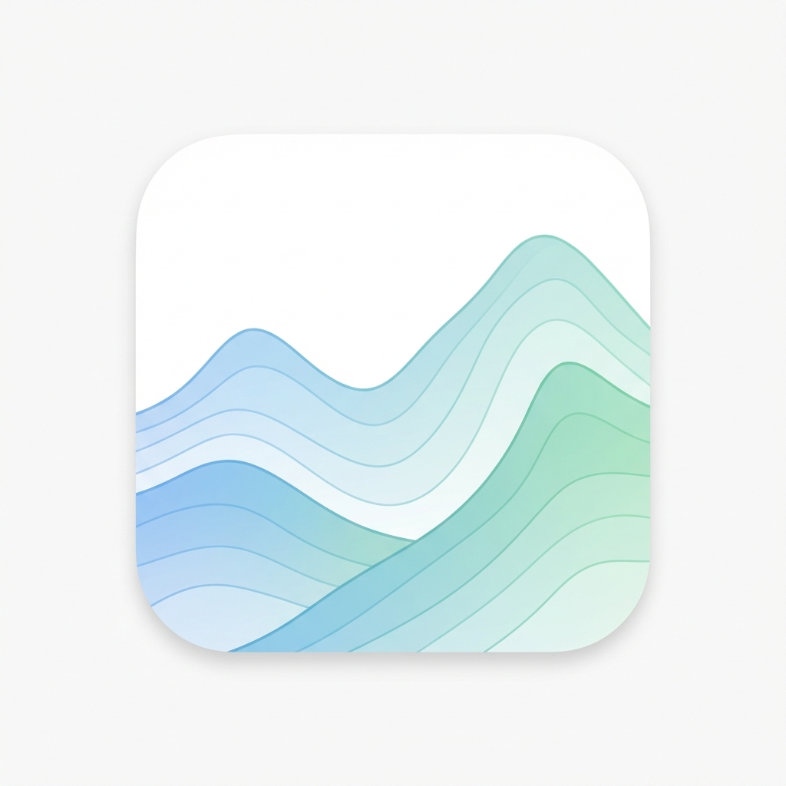

# Subscape

<p align="center">
  
</p>

<p align="center">
  <strong>Your subscription landscape at a glance</strong><br>
  A beautiful, offline-first PWA to track and manage all your subscriptions.
</p>

<p align="center">
  <a href="https://subscription-weld-eight.vercel.app">🌐 Live Demo</a> •
  <a href="#features">✨ Features</a> •
  <a href="#installation">📦 Installation</a> •
  <a href="#tech-stack">🛠️ Tech Stack</a>
</p>

---

<a name="features"></a>
## ✨ Features

### 📊 Multiple Dashboard Views
- **Landscape Mode** - Category terrain map with clickable islands
- **Time Wheel Mode** - Circular calendar showing payment distribution
- **Minimal Mode** - Clean statistics with category breakdowns

### 💰 Smart Financial Tracking
- Monthly average calculation (yearly subscriptions prorated)
- Multi-currency support (USD, KRW) with real-time FX rates
- Next payment preview with same-day grouping

### 🌍 Multi-Language Support
- English and Korean (한국어)
- Automatic date/currency localization

### 📱 PWA (Progressive Web App)
- Install on your iPhone home screen
- Works offline with local data storage
- Native app-like experience

### 🎨 Beautiful UI/UX
- Smooth animations with Framer Motion
- iOS-optimized touch interactions
- Safe area support for notched devices

---

## 📸 Screenshots

| Home Dashboard | Time Wheel | Landscape |
|:---:|:---:|:---:|
| Monthly total & next payments | Payment calendar wheel | Category terrain map |

---

<a name="installation"></a>
## 📦 Installation

### Prerequisites
- Node.js 18+ 
- npm or yarn

### Local Development

```bash
# Clone the repository
git clone https://github.com/bk123477/subscription.git
cd subscription

# Install dependencies
npm install

# Start development server
npm run dev
```

Open [http://localhost:3000](http://localhost:3000) in your browser.

### Production Build

```bash
# Create production build
npm run build

# Start production server
npm start
```

### Deploy to Vercel

```bash
# Deploy with Vercel CLI
npx vercel --prod
```

---

## 📱 Add to iPhone Home Screen

1. Open Safari and navigate to your deployed URL
2. Tap the **Share** button (⬆️)
3. Scroll down and tap **"Add to Home Screen"**
4. Tap **"Add"**

The app will appear on your home screen with the Subscape icon!

---

<a name="tech-stack"></a>
## 🛠️ Tech Stack

| Category | Technology |
|----------|------------|
| Framework | [Next.js 15](https://nextjs.org/) (App Router) |
| Language | [TypeScript](https://www.typescriptlang.org/) |
| Styling | [Tailwind CSS](https://tailwindcss.com/) |
| Animations | [Framer Motion](https://www.framer.com/motion/) |
| Database | [Dexie.js](https://dexie.org/) (IndexedDB) |
| Icons | [Lucide React](https://lucide.dev/) |
| Deployment | [Vercel](https://vercel.com/) |

---

## 📁 Project Structure

```
subscription/
├── app/                    # Next.js App Router
│   ├── (tabs)/            # Tab-based navigation
│   │   ├── home/          # Home dashboard
│   │   ├── schedule/      # Payment schedule
│   │   └── manage/        # Subscription management
│   ├── layout.tsx         # Root layout with PWA config
│   └── globals.css        # Global styles
├── components/
│   ├── home/              # Dashboard components
│   ├── schedule/          # Schedule components
│   ├── manage/            # Management components
│   └── ui/                # Reusable UI components
├── lib/
│   ├── db.ts              # Dexie database schema
│   ├── i18n.tsx           # Internationalization
│   ├── FxContext.tsx      # Currency conversion
│   └── billing.ts         # Payment calculations
├── translations/          # Language files
│   ├── en.ts
│   └── ko.ts
└── public/
    ├── manifest.json      # PWA manifest
    └── icons/             # App icons
```

---

## 🔧 Configuration

### Adding New Currencies

1. Update `lib/db.ts` to add currency type
2. Add exchange rate logic in `lib/FxContext.tsx`
3. Add currency labels in `translations/`

### Adding New Languages

1. Create new translation file in `translations/`
2. Import and register in `lib/i18n.tsx`

---

## 📄 License

MIT License - feel free to use this project for personal or commercial purposes.

---

## 🙏 Acknowledgments

- Built with ❤️ using Next.js and Tailwind CSS
- Icons by [Lucide](https://lucide.dev/)
- Deployed on [Vercel](https://vercel.com/)

---

<p align="center">
  <strong>Subscape</strong> — Track your subscriptions beautifully 🏔️
</p>
